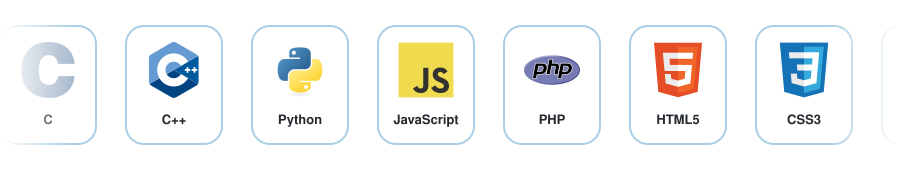

<!-- ===================== HEADER (animated wave) ===================== -->

<!-- Typing animation -->

 

---

## 👨‍💻 About Me

<!-- PROFILE PICTURE: shows your GitHub avatar now. To use your own photo, upload it to assets/profile.jpg and swap the url below
     with: https://wsrv.nl/?url=https://raw.githubusercontent.com/Asteriod-Destroyer-4/Asteriod-Destroyer-4/main/assets/profile.jpg&w=240&h=240&fit=cover&mask=circle -->

- 🔭 Software Engineer with knowledge in **Embedded Systems** and **Software Testing**
- 🌱 Exploring **Python, ML/AI, and automation testing**
- 🛠️ I enjoy turning ideas into working, well-tested software
- 📄 Click any project title below to open its documentation
- 📫 Reach me through the links at the bottom

 

---

## 📂 Projects & Documentation

> 👇 **Click a project title to expand it and view its document.**

<!-- ============ PROJECT 1 ============ -->

<h3 style="display:inline">🔹 Project Title 1</h3>

 

**📝 Description:** One or two lines about what the project does and the problem it solves.

**🧰 Tech Stack:** `Python` · `Pandas` · `Scikit-learn`

**📄 Documentation:** [**Open Project Document ➜**](docs/project-1.pdf)

**🔗 Source Code:** [GitHub Repository](https://github.com/Asteriod-Destroyer-4/project-1)

<!-- Optional: preview image of the document's first page -->

  

<!-- ============ PROJECT 2 ============ -->

<h3 style="display:inline">🔹 Project Title 2</h3>

 

**📝 Description:** Short summary of the project.

**🧰 Tech Stack:** `C++` · `Embedded C` · `Selenium`

**📄 Documentation:** [**Open Project Document ➜**](docs/project-2.pdf)

**🔗 Source Code:** [GitHub Repository](https://github.com/Asteriod-Destroyer-4/project-2)

  

<!-- ============ PROJECT 3 ============ -->

<h3 style="display:inline">🔹 Project Title 3</h3>

 

**📝 Description:** Short summary of the project.

**🧰 Tech Stack:** `Node.js` · `Express` · `HTML` · `CSS` · `JavaScript`

**📄 Documentation:** [**Open Project Document ➜**](docs/project-3.pdf)

**🔗 Source Code:** [GitHub Repository](https://github.com/Asteriod-Destroyer-4/project-3)

<!-- To add more projects, copy one 
 block and change the title, text and file paths -->

---

## 🛠️ Skills

<!-- Animated reel: scrolls continuously, each skill enlarges and shrinks in turn -->

<a href="https://asteriod-destroyer-4.github.io/Asteriod-Destroyer-4/skills.html"><b>🖱️ Open the interactive version (scroll + hover zoom) ➜</b></a>

---

## 📊 GitHub Stats

  
  

  

  

---

## 🤝 Connect With Me

  

